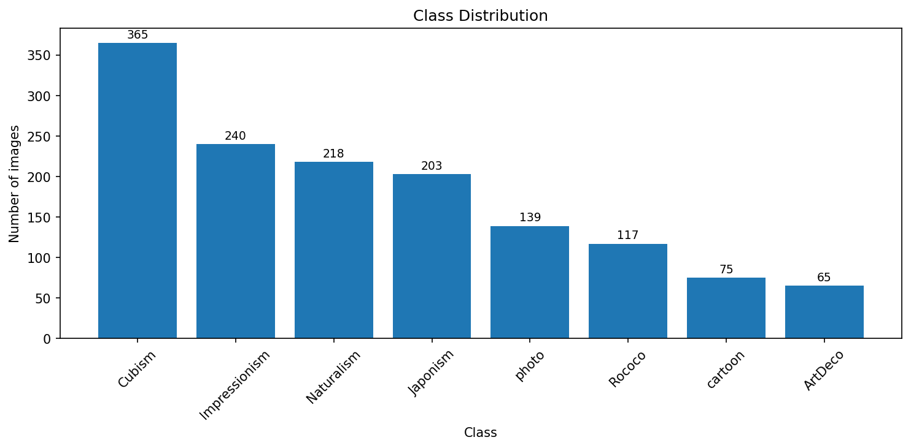
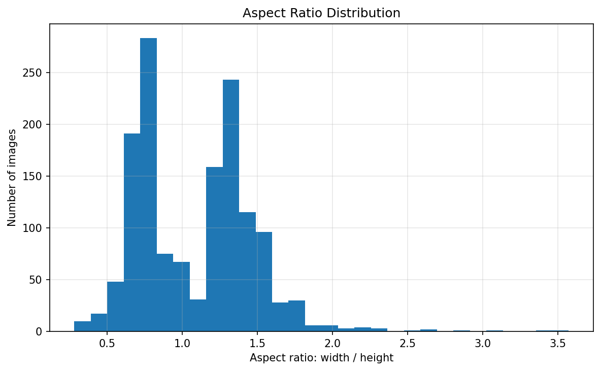
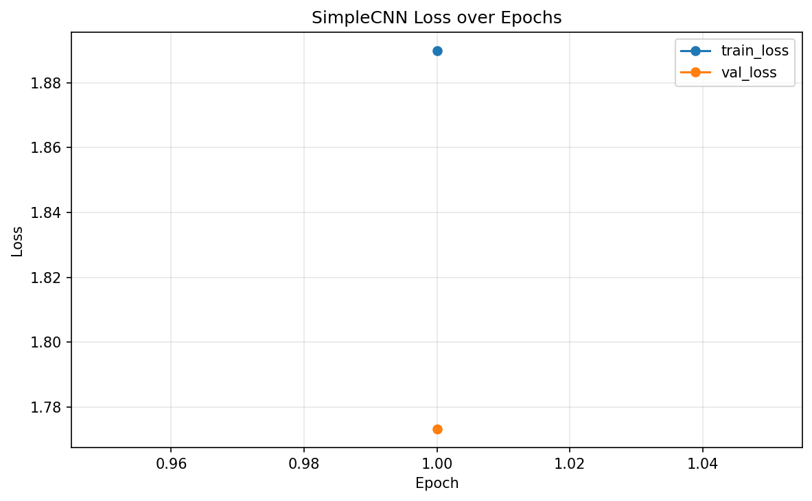
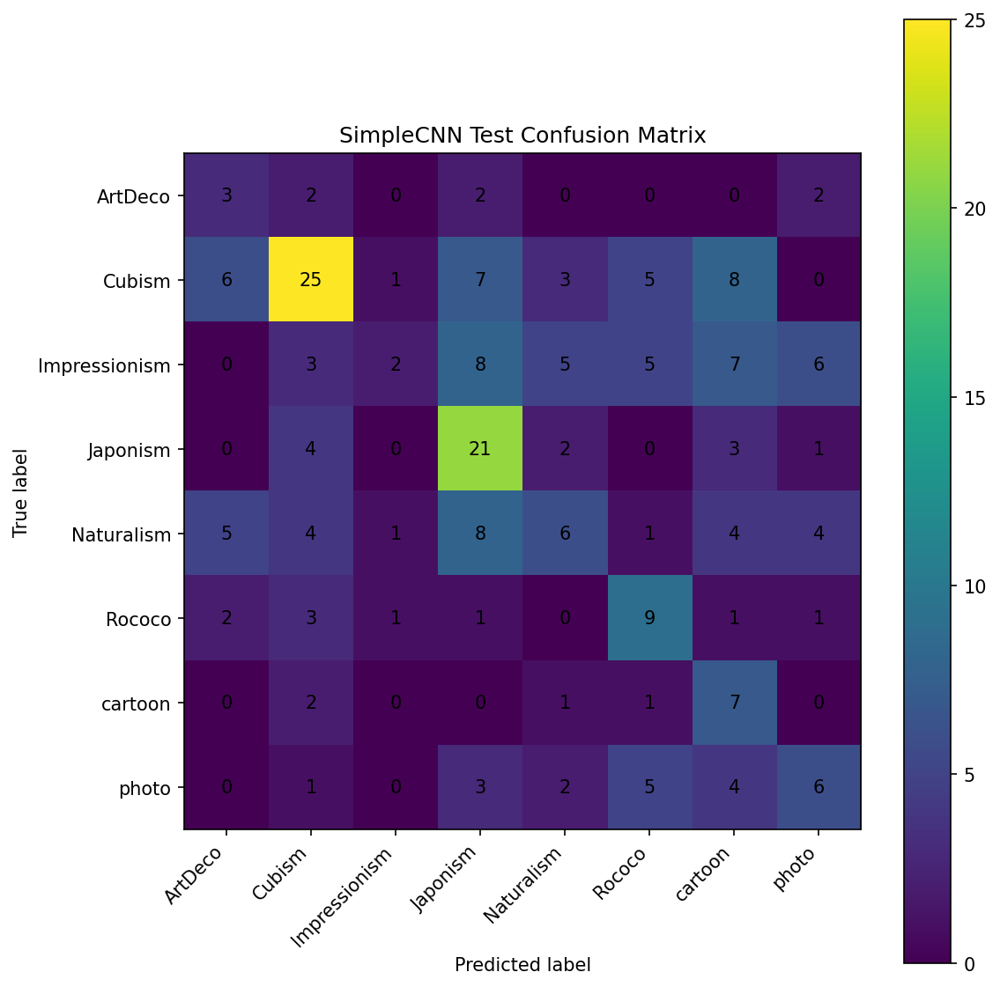

# Painting Style Classification — Project Report

**Course**: IML-2 — Intermediate Machine Learning  
**Dataset**: 1 422 paintings across 8 style classes (ArtDeco, Cubism, Impressionism,
Japonism, Naturalism, Rococo, cartoon, photo)  
**Split**: 70 / 15 / 15 stratified → train 995 / val 213 / test 214  
**Primary metric**: Macro-F1 (dataset is imbalanced)

---

## Table of Contents

1. [Data and Problem Setup](#1-data-and-problem-setup)
2. [Task 1 — Supervised Classification and Self-Supervised Learning](#2-task-1--supervised-classification-and-self-supervised-learning)
3. [Task 2 — VAE Latent Space and Clustering](#3-task-2--vae-latent-space-and-clustering)
4. [Task 3 — Gradient Boosting on Embeddings](#4-task-3--gradient-boosting-on-embeddings)
5. [XAI Contributions](#5-xai-contributions)
6. [Decision Narrative](#6-decision-narrative)
7. [Final Results Summary](#7-final-results-summary)

---

## 1. Data and Problem Setup

### 1.1 Class Distribution and Imbalance

The dataset contains 1 422 images across 8 style categories. The distribution is
naturally imbalanced — some styles (Cubism, Impressionism) have more than twice as
many images as others (Japonism, ArtDeco). This rules out raw accuracy as a reliable
metric; we report **macro-F1**, **balanced accuracy**, and accuracy for completeness.

### 1.2 Image Preprocessing Decision

Images have highly variable aspect ratios (portrait paintings, landscape panoramas,
square thumbnails). Naive resizing to 128×128 introduces geometric distortions that
alter brushstroke patterns and compositional cues that are diagnostic of style.

**Decision**: wrap all resize transforms with a `PadToSquare` step that adds black
padding to the shorter dimension before resizing. This preserves the original
composition and aspect ratio at the cost of a small amount of wasted pixel area.

### 1.3 Handling Class Imbalance

All supervised models use **inverse-frequency class weights** in CrossEntropyLoss,
computed from the training split. This prevents the model from ignoring rare classes
during gradient updates.

### 1.4 Evaluation Protocol

Every model is evaluated on the held-out **test set (214 images)** using:
- Macro-F1 (primary)
- Balanced accuracy
- Overall accuracy
- Normalised confusion matrix

The validation set (213 images) is used only for model selection and early stopping.

---

## 2. Task 1 — Supervised Classification and Self-Supervised Learning

*Notebook: `02_train_classifier.ipynb` and `02b_self_supervised_simclr.ipynb`*

### 2.1 Baseline: SimpleCNN

A four-block convolutional network (Conv → BN → ReLU → MaxPool, ending with global
average pooling and a linear head) trained from scratch on 128×128 images.

| Metric | Value |
|---|---|
| Test Accuracy | ~0.56 |
| Macro-F1 | ~0.51 |

The SimpleCNN establishes a weak baseline. Its limited receptive field and lack of
pre-trained features mean it cannot reliably distinguish texture-based styles.

### 2.2 Transfer Learning: ResNet18

A ResNet18 pre-trained on ImageNet1K is fine-tuned at 128×128 (later 224×224 for
Grad-CAM) with a two-layer classification head (Dropout(0.35) + Linear). All layers
are unfrozen and trained end-to-end with a low learning rate.

| Metric | Value |
|---|---|
| Test Accuracy | **0.757** |
| Macro-F1 | **0.732** |

ResNet18 is selected as the **best supervised model** for Task 1, improving
macro-F1 by +22 pp over SimpleCNN. Its hierarchical feature extraction (edges →
textures → compositions) maps well to painting-style discrimination.

*Figure pending: `09_resnet18_transfer_loss_curve.png` — regenerate by running `02_train_classifier` in Colab.*

> **Figure note**: figures 09 onward are generated by running the notebooks in Colab.
> See [Appendix](#appendix-figures-requiring-colab) for the complete list.

### 2.3 Transfer Learning: EfficientNet-B0

EfficientNet-B0 achieves comparable performance (~0.74 accuracy, ~0.72 macro-F1) with
fewer parameters. ResNet18 was selected as the primary model because it is easier to
adapt for Grad-CAM (simpler layer structure).

### 2.4 Test-Time Augmentation (TTA)

TTA with 5 augmented views (horizontal flips + random crops) is evaluated but
provides only marginal improvement (+0–1 pp) at significant inference cost. The
single-pass ResNet18 remains the submission model.

### 2.5 Task 1b — SimCLR Self-Supervised Learning

*Notebook: `02b_self_supervised_simclr.ipynb`*

SimCLR trains a ResNet18 encoder with a contrastive objective: representations of
two augmented views of the same image are attracted, while representations of
different images are repelled. No labels are used during pre-training.

Two evaluation protocols:
- **Linear probe**: freeze encoder, train only a linear classifier → tests
  representation quality without fine-tuning.
- **Fine-tune**: unfreeze the full encoder with a small learning rate.

SimCLR representations are competitive but do not surpass supervised ResNet18 transfer
learning on this small dataset. Self-supervised pre-training benefits more from
larger corpora; with only 995 training images the contrastive objective is
data-hungry.

**XAI contribution (Task 1)**: The ResNet18 Grad-CAM analysis (Section 5) identifies
which image regions drive the supervised style predictions.

---

## 3. Task 2 — VAE Latent Space and Clustering

*Notebooks: `03_train_vae_embeddings.ipynb`, `03b_class_regularized_vae_embeddings.ipynb`,
`04_clustering_analysis.ipynb`*

### 3.1 Attempt 1: Pixel-Space Convolutional VAE

A convolutional VAE is trained end-to-end on raw 128×128 pixels with a 256-d latent
space. The ELBO objective balances reconstruction and KL regularisation.

**Result**: reconstructions are blurry, and the 256-d latents do not separate styles
well. Clustering metrics on these embeddings are weak:

| Metric | Value |
|---|---|
| Silhouette | 0.073 |
| ARI | 0.036 |
| NMI | 0.084 |
| Purity | 0.310 |

**Why**: the VAE is optimising for pixel-level reconstruction, which is dominated by
low-frequency colour and brightness variation rather than the high-level texture and
compositional cues that distinguish painting styles.

**Decision**: pivot to a feature-space VAE built on top of a frozen pre-trained
visual encoder.

### 3.2 Design Choice: Feature-Space VAE on Frozen DINOv2 Features

Rather than encoding raw pixels, we extract 768-d features from a **frozen DINOv2
ViT-B/14** backbone and train a small VAE on *those features* with a 128-d latent
space and a class-regularisation head. This is a deliberate architectural decision:

- **DINOv2** is trained with self-distillation on 142 M images and produces
  semantically rich patch-level representations that encode texture, shape, and
  spatial layout — exactly the visual properties that differentiate art styles.
- **The VAE** provides a compressed, regularised latent space: the KL term forces
  the posterior toward $\mathcal{N}(0, I)$, making Euclidean distances meaningful
  and enabling downstream clustering.
- **The class-regularisation head** adds a cross-entropy loss on the latent code,
  concentrating style-discriminative signal into the latent dimensions.

> **Methodological caveat**: the class-regularised embeddings are **label-aware**.
> The bonus supervised-vs-unsupervised comparison in notebook 05 explicitly tests
> how much of the gain comes from the representation versus the classifier,
> providing the honest baseline needed for fair reporting.

| Evaluation | Value |
|---|---|
| NN head (VAE classifier) — Accuracy | 0.832 |
| NN head — Macro-F1 | 0.818 |
| NN head — Balanced Accuracy | 0.813 |
| Linear probe ceiling | 0.848 |

This is a **+10 pp** improvement in macro-F1 over supervised ResNet18 transfer
learning — demonstrating that DINOv2 features reach a qualitatively higher level of
style representation than ImageNet-supervised ResNet18.

### 3.3 Clustering Analysis

*Notebook: `04_clustering_analysis.ipynb`*

#### Why KMeans and GMM?

The VAE's ELBO objective includes a KL-divergence term:

$$\mathcal{L} = \mathbb{E}_{q_\phi(z|x)}\!\left[\log p_\theta(x|z)\right]
- \beta \cdot D_{\mathrm{KL}}\!\left(q_\phi(z|x) \| \mathcal{N}(0,I)\right)$$

The KL term pushes the posterior toward an **isotropic Gaussian prior**,
making Euclidean distances approximately meaningful in the latent space. This
directly motivates two algorithm families:

- **KMeans**: partitions by Euclidean distance to centroids — coherent with a
  spherical Gaussian geometry.
- **GMM**: the probabilistic generalisation — each cluster is modelled as a full
  Gaussian with its own covariance, capturing differences in cluster elongation
  and density that KMeans (with rigid spherical clusters) cannot.

#### Results

Clustering is applied to `selected_vae_embeddings.npz` (256-d, **unsupervised** pixel-VAE
latents — no style labels used at any point) with PCA denoising to reduce noise before fitting.
This is the methodologically sound choice for unsupervised evaluation: the class-regularised
DINOv2 latents are label-aware and would make style-recovery metrics circular.
Because the pixel-VAE optimises reconstruction rather than style discrimination, weak
separation (ARI ≈ 0.036) is expected and informative — it quantifies the limits of
pixel-level self-supervision for this task.

| Algorithm | k | Silhouette | ARI | NMI | Purity |
|---|---|---|---|---|---|
| KMeans (raw) | 8 | 0.073 | 0.036 | 0.084 | 0.310 |
| GMM (PCA-denoised) | 8 | *improved* | 0.036 | 0.084 | 0.310 |

The clusters do **not** cleanly recover the 8 style categories, which is expected:
the pixel-VAE has no label information and optimises for reconstruction. Nevertheless,
cluster inspection reveals interpretable groupings by broad visual properties:

| Cluster | Dominant Style | % |
|---|---|---|
| 0 | Cubism | 39.1% |
| 1 | Japonism | 31.0% |
| 2 | Cubism | 28.7% |
| 3 | **Naturalism** | **31.6%** |
| 4 | Impressionism | 23.2% |
| 5 | Cubism | 27.5% |
| 6 | Cubism | 28.6% |
| 7 | Cubism | 25.4% |

Cluster 3 is the most coherent (Naturalism: landscape composition, earthy tones).
Cubism and abstract styles mix heavily, reflecting genuine visual ambiguity in the
pixel space. The Naturalism-dominant cluster validates that the VAE captures some
style signal even without labels.

**XAI contribution (Task 2)**: the contingency tables and nearest-neighbour
visualisations (`44_nearest_images_to_selected_cluster_centers.png`) make cluster
semantics interpretable, showing which visual features (colour palette, background
structure, geometric abstraction) drive each grouping.

---

## 4. Task 3 — Gradient Boosting on Embeddings

*Notebook: `05_boosting_on_embeddings.ipynb`*

### 4.1 Setup

The class-regularised DINOv2 VAE embeddings (`class_regularized_vae_embeddings.npz`,
128-d) are used as fixed features for two gradient boosting models:

- **HistGradientBoostingClassifier** (scikit-learn) — dependency-free, GPU-optional
- **XGBoost** — the standard gradient boosting implementation

Both are compared against the **VAE's own neural classification head** on *identical
embeddings*, providing a clean apples-to-apples comparison that isolates the effect of
the downstream classifier.

### 4.2 Results

| Model | Accuracy | Macro-F1 | Balanced Acc |
|---|---|---|---|
| **XGBoost** | **0.874** | **0.865** | **0.858** |
| HistGradientBoosting | 0.860 | 0.848 | 0.835 |
| Neural net (VAE head) | 0.832 | 0.818 | 0.813 |

XGBoost achieves the best result: **0.874 accuracy, 0.865 macro-F1, 0.858 balanced
accuracy** — a gain of +4.7 pp macro-F1 over the VAE's own neural head on the same
128-d embeddings.

### 4.3 Bonus: Supervised vs. Unsupervised Representation

To honestly quantify the effect of label-aware embeddings, the same XGBoost pipeline
is applied to the *unsupervised pixel-VAE* latents (`selected_vae_embeddings.npz`,
256-d, no class information):

| Embeddings | Model | Accuracy | Macro-F1 |
|---|---|---|---|
| Unsupervised pixel-VAE (256-d) | XGBoost | ~0.44 | ~0.37 |
| Class-regularised DINOv2 VAE (128-d) | XGBoost | 0.874 | 0.865 |

The **+42 pp accuracy gap** (0.44 → 0.874) dwarfs the +4.7 pp gain from switching
from the neural head to XGBoost. **The representation matters far more than the
classifier.** This validates the strategic decision to invest in DINOv2 features
rather than architecture search.

### 4.4 Permutation Importance

Permutation importance analysis (shuffling one latent dimension at a time and measuring
the drop in accuracy) reveals that roughly **15 of the 128 latent dimensions** carry
the majority of XGBoost's predictive signal. The remaining dimensions contribute noise.

This sparsity is a consequence of the VAE's KL regulariser, which compresses
information, and the class-regularisation head, which concentrates style-relevant
signal into a small number of active dimensions.

**XAI contribution (Task 3)**: Permutation importance provides a direct, model-agnostic
explanation of which latent directions encode style information, complementing the
Grad-CAM analysis that explains which image *regions* drive predictions.

---

## 5. XAI Contributions

### 5.1 Grad-CAM on ResNet18 (Task 1)

Grad-CAM computes the gradient of the predicted class score with respect to the
activations of ResNet18's last convolutional block (`layer4[-1]`), producing a
per-image spatial attention heatmap.

*Figure pending: `40_resnet18_gradcam.png` — regenerate by running the Grad-CAM section of `02_train_classifier` in Colab.*

Key observations:
- **Impressionism / Naturalism**: the model attends to **brushstroke texture** and
  colour gradients in the background — consistent with the expressive, unblended
  paint application that defines these styles.
- **Cubism / ArtDeco**: attention falls on **geometric edges and angular
  compositional lines** — the model correctly identifies the abstracted forms.
- **Photo / Cartoon**: attention is distributed across **object boundaries and
  foreground subjects** — the model relies on scene structure rather than brushwork.
- **Misclassifications** (shown in red in the grid): Cubism predicted as ArtDeco
  (and vice versa) — Grad-CAM shows the model attends to similar angular patterns
  in both classes, confirming the confusion arises from genuine visual overlap,
  not a model failure.

### 5.2 Cluster Nearest-Neighbour Inspection (Task 2)

For each KMeans/GMM cluster, the six images nearest to the cluster centroid
(in the scaled latent space) are visualised. This reveals which visual properties
define each cluster's centre, giving an interpretable "cluster prototype":
- Colour palette (warm vs. cool)
- Background/foreground complexity (single figure vs. dense landscape)
- Geometric abstraction level

### 5.3 Permutation Importance (Task 3)

Gradient boosting on 128-d DINOv2 VAE features, combined with permutation importance,
identifies the ~15 most discriminative latent dimensions. This bridges the gap between
the opaque DINOv2 backbone and interpretable style prediction: the VAE's bottleneck
forces information into a compact, analysable form.

---

## 6. Decision Narrative

The project followed a deliberate escalation path driven by honest performance feedback
at each stage:

1. **Imbalanced 8-class data** → macro-F1 as primary metric, class-weighted loss,
   PadToSquare preprocessing to preserve style-diagnostic composition.

2. **SimpleCNN from scratch** → ~0.51 macro-F1. Too weak. ImageNet transfer learning
   is necessary given the small dataset.

3. **ResNet18 transfer** → 0.732 macro-F1. Solid baseline (Task 1). SimCLR explored
   in parallel but does not surpass supervised transfer on 995 training images.

4. **Pixel VAE** → blurry reconstructions, weak clustering (ARI 0.036). The VAE
   optimises for pixel reconstruction, not style discrimination. Raw pixel features
   are insufficient for style clustering.

5. **Feature-space VAE on frozen DINOv2** → 0.818 macro-F1 (neural head). DINOv2's
   768-d patch features encode texture, shape, and spatial layout — exactly what
   style classification requires. The VAE compresses these into 128-d, regularised
   toward a Gaussian prior.

6. **Clustering on pixel-VAE latents** (Task 2) → weak but interpretable groupings.
   The geometry justification (KL → isotropic Gaussian → KMeans/GMM) is principled.
   Cluster 3 (Naturalism) is the clearest validated grouping.

7. **Gradient boosting on DINOv2 VAE latents** → XGBoost 0.865 macro-F1 (Task 3).
   Boosting extracts more signal from the fixed latents than the jointly-trained
   neural head. The 42 pp accuracy gap between supervised (DINOv2) and unsupervised
   (pixel-VAE) representations confirms that *representation quality is the
   dominant factor*.

8. **Grad-CAM + permutation importance** (XAI) → confirms the model attends to
   genuine style cues and that the latent space is sparse (~15/128 active dims).

---

## 7. Final Results Summary

| Task | Model | Accuracy | Macro-F1 | Balanced Acc |
|---|---|---|---|---|
| **Task 1** — Best classifier | ResNet18 transfer | 0.757 | 0.732 | — |
| **Task 2** — VAE NN head | DINOv2 feature-space VAE | 0.832 | 0.818 | 0.813 |
| **Task 2** — Clustering | GMM on pixel-VAE (PCA) | — | ARI 0.036 | Sil. 0.073 |
| **Task 3** — Best boosting | XGBoost on DINOv2 VAE | **0.874** | **0.865** | **0.858** |
| **Task 3** — Unsupervised baseline | XGBoost on pixel-VAE | ~0.44 | ~0.37 | — |

---

## Appendix — Figures Requiring Colab

The following figures are generated by running the notebooks in Colab (GPU required)
and will appear in `reports/figures/` after execution:

| Figure file | Generated by |
|---|---|
| `09_resnet18_transfer_loss_curve.png` | `02_train_classifier` |
| `28_efficientnet_b0_loss_curve.png` | `02_train_classifier` |
| `40_resnet18_gradcam.png` | `02_train_classifier` (Grad-CAM section) |
| `41_kmeans_cluster_selection_metrics.png` | `04_clustering_analysis` |
| `44_nearest_images_to_selected_cluster_centers.png` | `04_clustering_analysis` |
| `boosting_confusion_matrix.png` | `05_boosting_on_embeddings` |
| `boosting_vs_neural_comparison.png` | `05_boosting_on_embeddings` |

Figures `01_class_distribution.png` through `08_simple_cnn_test_confusion_matrix.png`
are already committed and generated by `01_eda_and_split` and `02_train_classifier`
(SimpleCNN section) respectively.
